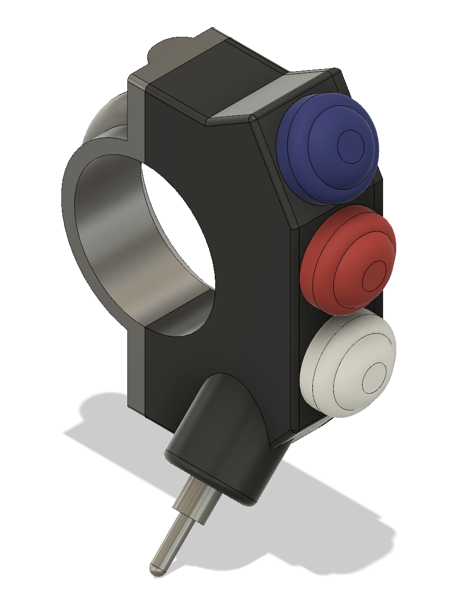
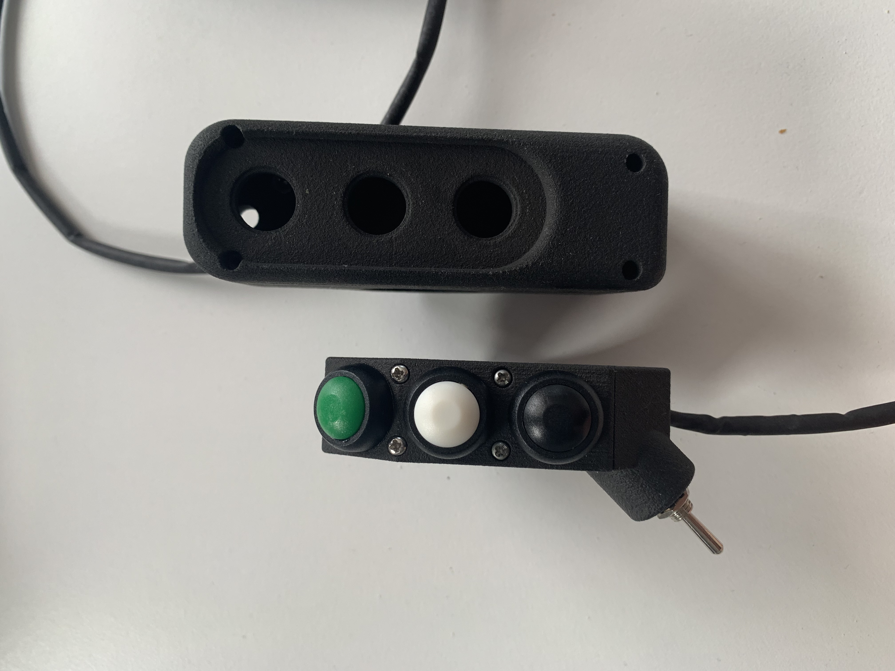
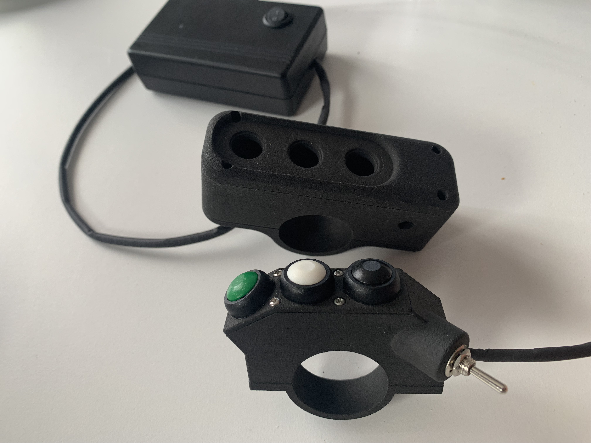
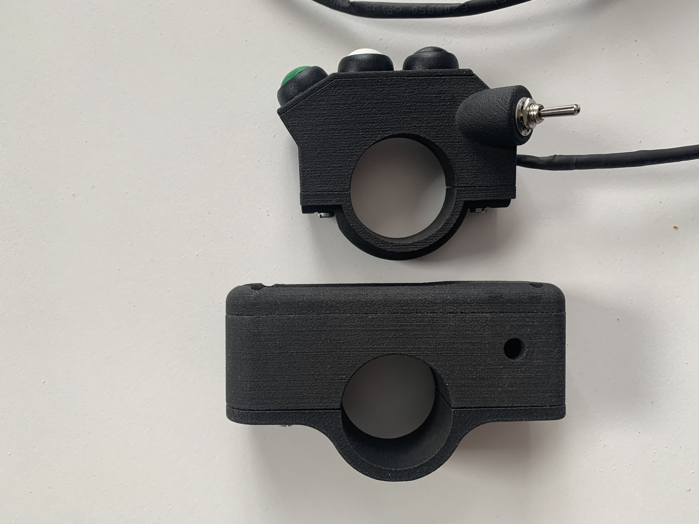

# Intro

This is a Bluetooth based smartphone/ tablet controller for the comfortable interactions with your navigation (not limited to but mainly for _OsmAnd_, _Locus Map_ and _Rally Roadbook Reader_ app) while riding your bike.

Current models are designed to be mounted over the grips, i.e. no manipulation with the handlebar setup is required other than just securing the controller on the left hand grip. Eventually the versions with other mounting diameters will appear.

The solution consists of 2 parts connected with the cable: hand grip module and the box with a dev board and batteries.

## Right now there're two versions of the grip module:
1. **V2 aka Slim** redesigned controller. As rigit as V1, but signnificantly slimmer, with ergonomicly designed toggle switch position.   
2. **V1** which is quite wide and eats up a lot of grip space, plus it's looking rather basic - still functioning well. If printed out of nylon is rigit as hell. I personally would definitely go for the V2 Slim, but if you're curious you can still check the V1 here: [V1 3D](Docs/Pics/V1/1.png) and [V1 Assembled](Docs/Pics/V1/IMG_2272.jpeg)

The box with a dev board and batteries is basically somewhat of a water protected box to store the brains of the controller - check the [MAC Parts](Docs/parts.numbers) or [Excel Parts but w/o pics](Docs/parts.xlsx) for details.

# Instructions
## How to assemble one
1. Get the list of components listed in [MAC Parts](Docs/parts.numbers) or [Excel Parts but w/o pics](Docs/parts.xlsx)
2. Order the 3D prints. You gotta chose between the [V1](V1/Hardware/casing) and [V2 Slim](Slim/Hardware/case). Both are perfectly fine and durable, except the V2 is obviously slimmer and more compact compared to V1.
3. Flash the board. Both V1 and V2 Slim are based on ESP32 Wroom. You'll need the [BLE lib](Code/ESP32-BLE-Keyboard-master). Switching to [Seeed Studio XIAO nRF52840](https://wiki.seeedstudio.com/XIAO_BLE/)  is yet to come - this should improve the size of the external box.
4. Assemble the project. You'll need a soldering iron! Should you have any troubles on this step, give me a shout.
5. Turn the device on and connect it to your smartphone from Settings->Bluetooth
6. Configure the apps on the phone to react to the keys properly

## Buttons

### Buttons Defaults
From top to bottom the keys sent to the device are: letter "C", "Up Arrow", "Down Arrow". Toggle switch Vol+ when pressed towards, and Vol- when pulled.

### Navigation
Buttons cover the main functionality for the 2 navigation apps that are the most interesting for the author:
1. C to center the map
2. Vol+ and Vol- to zoom in and out
3. Up and Down Arrows for OsmAnd to move the map up and down

## Rally Roadbook Reader
Work in progress.
The solution is trivial: add a hardware switch and adjust the code to switch the key mapping. Unfortunately there's no common solution for both navigation and rally roadbook as some keys are different, but the common keys do different things. RRR does not let other keys to be assigned in the app, or the author was not clever enough to finnd the hidden settings.

## OsmAnd Setup
Follow the guide from the [official page](https://osmand.net/docs/user/map/interact-with-map/#external-input-device-buttons) to turn on the support of the External Input Devices. Also enable zoom in-out with volume buttons. If for any reason you would not want to do this last step, you would need to reconfigure the .ino sketch and adjust the code to send other keys.

# V1 vs. V2 Slim

# Credits
This project was inspired by another open source project [rallyrampage](https://www.rallyrampage.com/product/bluetooth-navigation-handlebar-controller-version-1-7-3-6b/)
You cannot reinvent something so simple, but i did put some efforts to make the controller look just a bit nicer and reduce the costs of the components.
