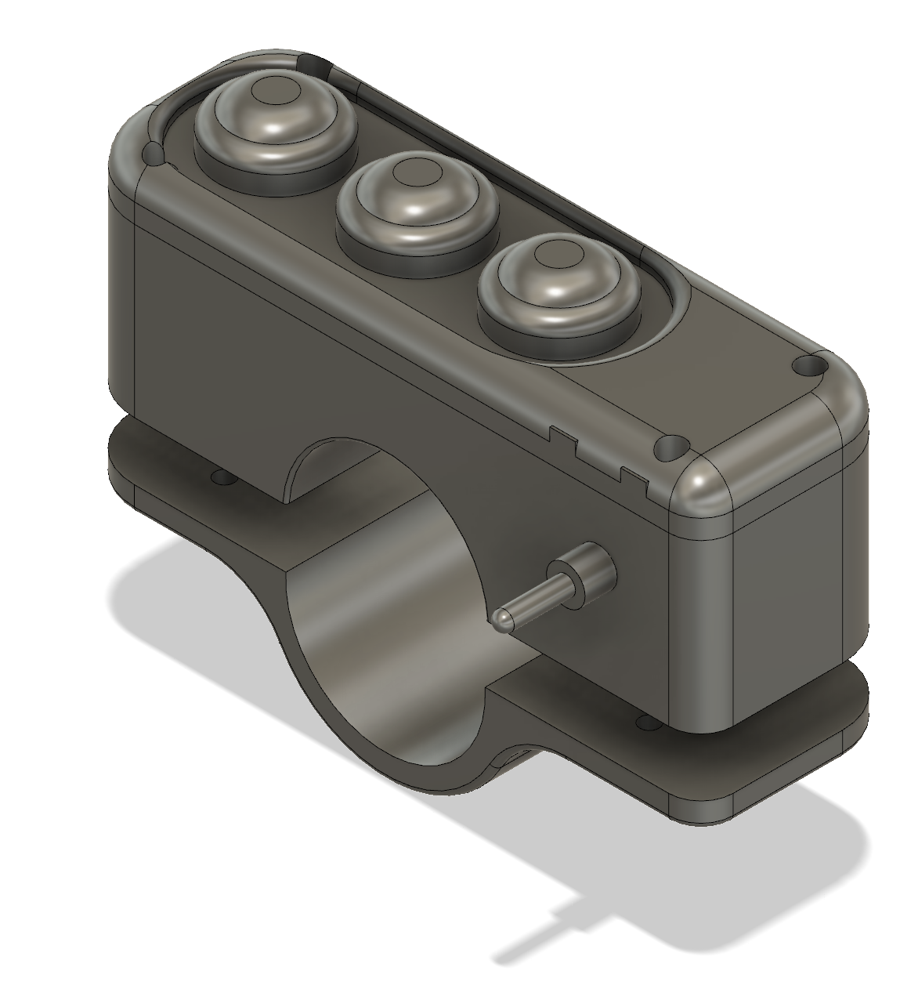
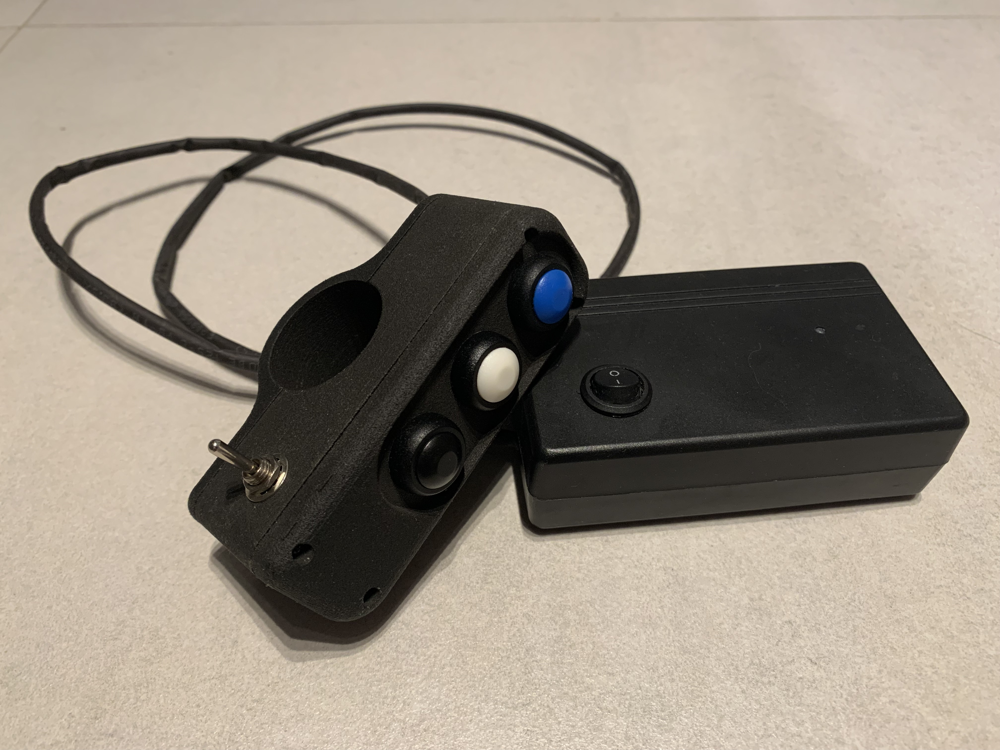
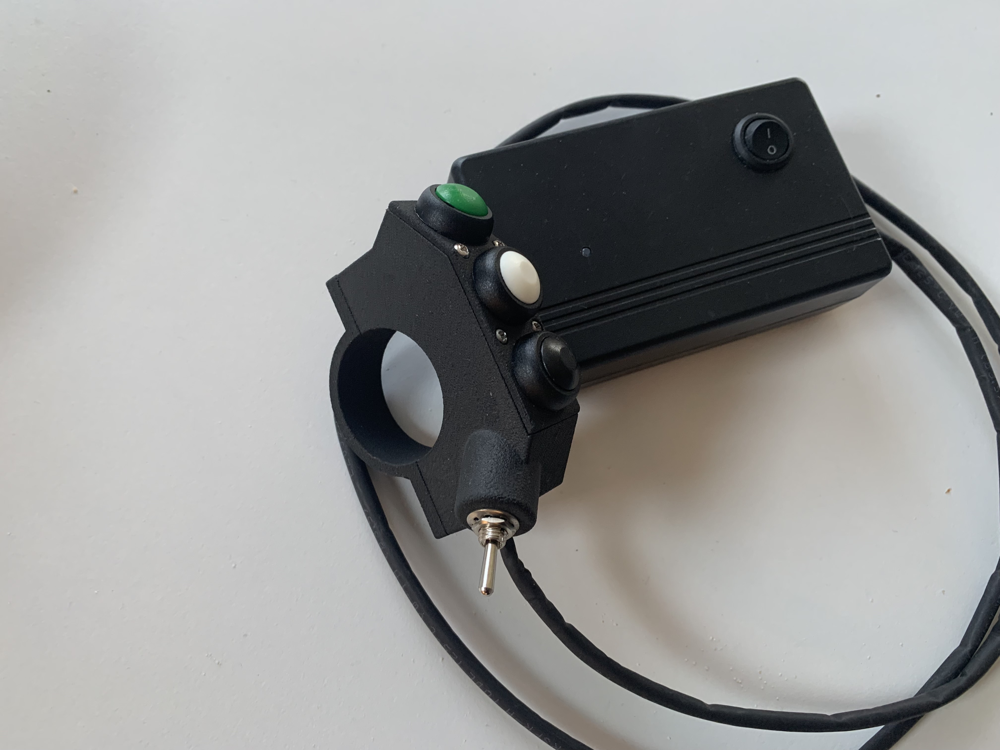

# Intro

This is a Bluetooth based smartphone controller for the comfortable interactions with your navigation (not limited to but mainly for _OsmAnd_, _Locus Map_ and _Rally Roadbook Reader_ app) while riding your bike.

Current models are designed to be mounted over the grips, i.e. no manipulation with the handlebar setup is required other than just securing the controller on the left hand grip. Eventually the versions with other mounting diameters will appear.

Right now there're two versions:
1. **V1** which is quite wide and eats up a lot of grip space, plus it's looking rather basic. Still functioning well, and if printed out of nylon is rigit as hell.
 
2. **V2 aka Slim** redesigned controller. Still rigit, but signnificantly slimmer, with ergonomicly designed toggle switch position. Also exploring the options to switch to a smaller board (Seeed Studio XIAO nRF52840)[https://wiki.seeedstudio.com/XIAO_BLE/] to improve the size of the board and battery box.

# Instructions
## How to assemble one
1. Get the list of components listed in [MAC Parts](Docs/parts.numbers) or [Excel Parts but w/o pics](Docs/parts.xlsx)
2. Order the 3D prints. Models located [here](Hardware/casing) - you gotta chose between the tested V1 and V2 Slim which is still in dev.
3. Flash the board. V1 is based on ESP32 Wroom - a bigger board, but the wiring and the code should work fine. You'll need the [BLE lib](Code/ESP32-BLE-Keyboard-master). V2 based on Seeed Xiao BLE nRF52840 is yet to come.
4. Assemble the project. You'll need a soldering iron!
5. Turn the device on and connect it to your smartphone
6. Configure the apps on the phone to react to the keys properly

## Buttons

### Buttons Defaults
From top to bottom the keys sent to the device are: letter "C", "Up Arrow", "Down Arrow". Toggle switch Vol+ when pressed towards, and Vol- when pulled.

### Navigation
Buttons cover the main functionality for the 2 anvigation apps that are the most interesting for the author:
1. C to center the map
2. Vol + and - to zoom in and out
3. Up and Down Arrows for OsmAnd to move the map up and down

## Rally Roadbook Reader
Work in progress.
the solution is trivial: add a hardware switch and adjust the code to switch the key mapping. Unfortunately there's no common solution for both navigation and rally roadbook as some keys are different, but the common keys do different things. RRR does not let other keys to be assigned in the app, or the author was not clever enough to finnd the hidden settings.

## OsmAnd Setup
Follow the guide from the [official page](https://osmand.net/docs/user/map/interact-with-map/#external-input-device-buttons) to turn on the support of the External Input Devices. Also enable zoom in-out with volume buttons if you would like to use the controller together with other apps. If for any reason you would not want to do this last step, you would need to reconfigure the .ino sketch and adjust the code to send other keys.

# Outro
This project was inspired by another free project [rallyrampage](https://www.rallyrampage.com/product/bluetooth-navigation-handlebar-controller-version-1-7-3-6b/)
You cannot reinvent something so simple, but i did put some efforts to make the controller look just a bit nicer and reduce the costs of the components.
